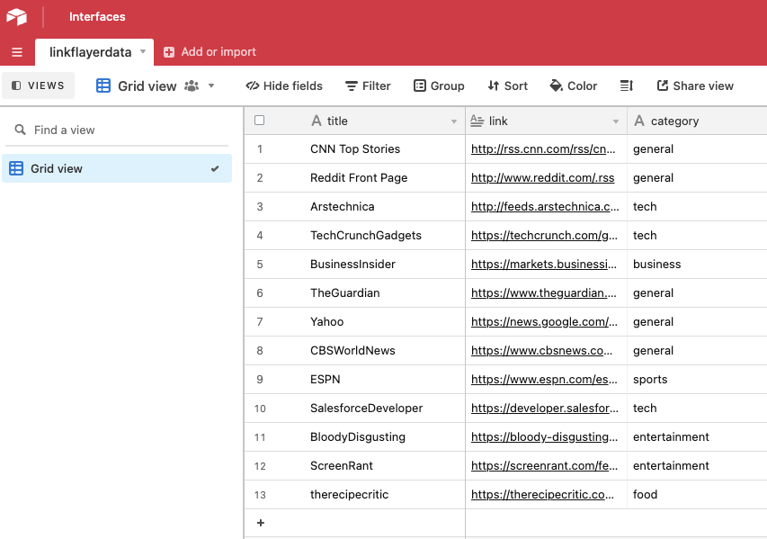
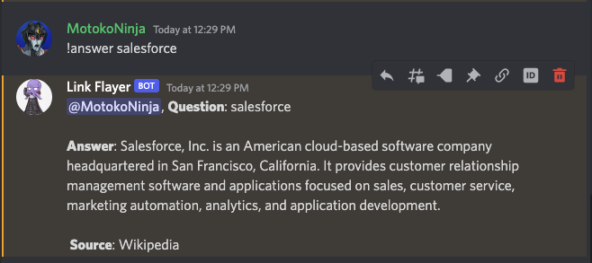

# 🔗 Link-Flayer

[](https://discord.com/api/oauth2/authorize?client_id=820809725398089779&permissions=2048&scope=bot)
[](https://nodejs.org)
[](https://www.npmjs.com/package/link-flayer)

A modern Discord bot that brings RSS newsfeeds, instant web searches, and more to your Discord server! 📰

## ✨ Features

- 📰 RSS News Feed Integration
- 🔍 Instant Web Searches
- 🤖 OpenAI ChatGPT Integration
- 📊 Airtable Database Support
- 🎮 Interactive Commands
- 🌦️ Weather Alerts
- 📈 Stock Information
- 🎲 Trivia Games
- 🍳 Recipe Suggestions
- 💻 Code Snippet Search

## 🚀 Quick Start

### Installation

```bash
# Using npm
npm install link-flayer

# Or from source
git clone https://github.com/johnfacey/link-flayer.git
```

### Configuration

1. Get your Discord Bot Token from [Discord Developer Portal](https://discord.com/developers/applications/)
2. Create a `.env` file with the following variables:

```env
DATABASE_URL=''
TOKEN=''
KEY=''
BASE=''
TABLE=''
OPENAI_API=''
OPENAI_ORG=''
```

### Airtable Setup

Configure your `feeds.json` with nodes containing:
- `title`
- `link`
- `category`



## 🤖 Bot Invitation

Add Link-Flayer to your server using this link:
[Invite Link](https://discord.com/api/oauth2/authorize?client_id=820809725398089779&permissions=2048&scope=bot)

## 📝 Available Commands

| Command | Description | Example |
|---------|-------------|---------|
| `!help` | Lists all available commands | `!help` |
| `!chat` | Queries OpenAI Model | `!chat what is a pizza` |
| `!search` | Searches RSS Sources | `!search google` |
| `!get` | Retrieves Search By Index | `!get 25` |
| `!add` | Add new RSS Source Feed | `!add http://www.engadget.com/rss.xml` |
| `!update` | Updates all RSS Feeds | `!update` |
| `!quote` | Random quote | `!quote` |
| `!random` | Random article | `!random` |
| `!random category` | Random article by category | `!random sports` |
| `!answer` | Instant Live Search | `!answer salesforce` |
| `!slang` | Urban Dictionary Search | `!slang slang` |
| `!stock` | Stock Information | `!stock IBM` |
| `!play` | Trivia game | `!play` |
| `!npm` | NPM package info | `!npm axios` |
| `!alert` | Weather alerts | `!alert TX` |
| `!calc` | Calculator | `!calc 2 + 2` |
| `!food` | Random recipe | `!food` |
| `!code` | Code snippet search | `!code python loop` |

## 📸 Preview



## 📄 License

This project is licensed under the MIT License - see the [LICENSE](LICENSE) file for details.
